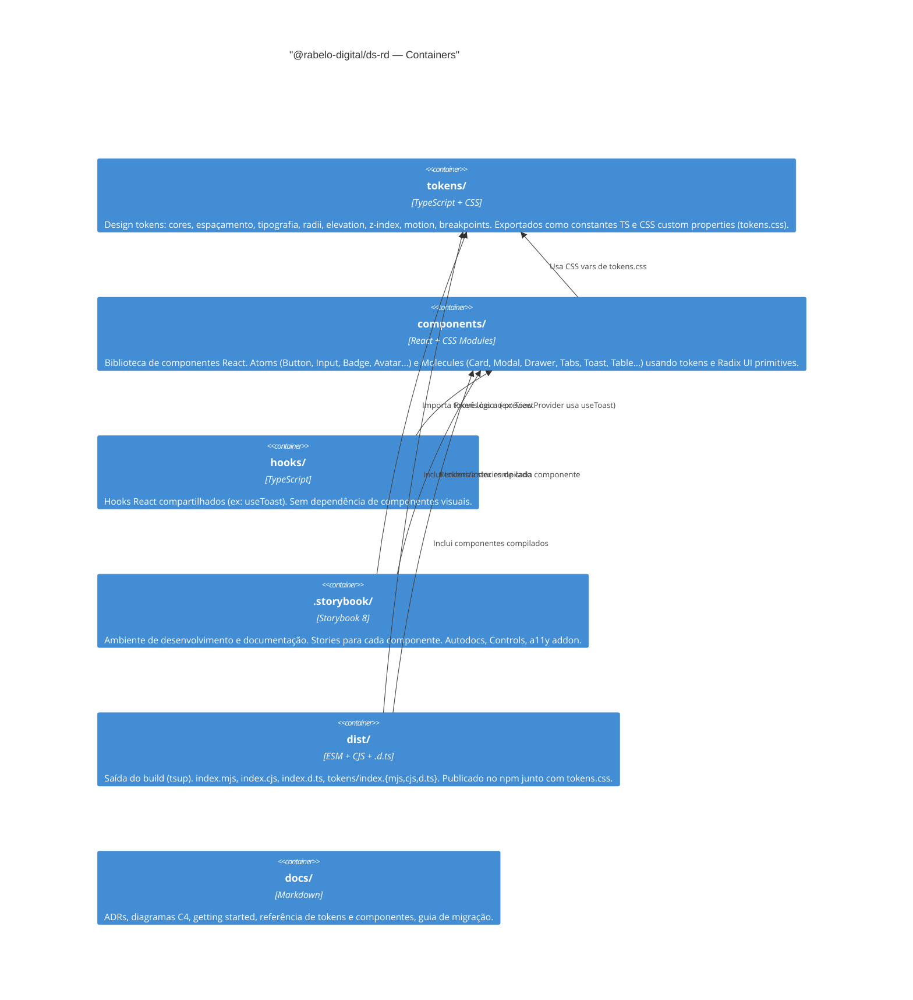

# C4 — Nível 2: Containers do Design System



## Estrutura de arquivos

```
ds-rd/
├── src/
│   ├── index.ts              # Entry point principal
│   ├── tokens/               # Design tokens
│   │   ├── colors.primitive.ts
│   │   ├── colors.semantic.ts
│   │   ├── spacing.ts
│   │   ├── typography.ts
│   │   ├── radii.ts
│   │   ├── elevation.ts
│   │   ├── zIndex.ts
│   │   ├── motion.ts
│   │   ├── breakpoints.ts
│   │   └── index.ts
│   ├── components/
│   │   ├── atoms/            # Button, Input, Textarea, Badge, Avatar,
│   │   │                     # Checkbox, Radio, Select, Tooltip, SocialIcons
│   │   ├── molecules/        # Card, Modal, Drawer, Tabs, Accordion,
│   │   │                     # Toast, Table
│   │   └── index.ts
│   ├── hooks/                # useToast e futuros hooks compartilhados
│   └── test/setup.ts         # @testing-library/jest-dom
├── .storybook/
│   ├── main.ts
│   ├── preview.ts
│   └── theme.ts
├── docs/
│   ├── adr/                  # Architecture Decision Records
│   └── c4/                   # Diagramas C4
├── tokens.css                # CSS custom properties geradas dos tokens
├── tsup.config.ts
├── tsconfig.json
├── vitest.config.ts
└── .github/workflows/
    ├── ci.yml
    └── release.yml
```
