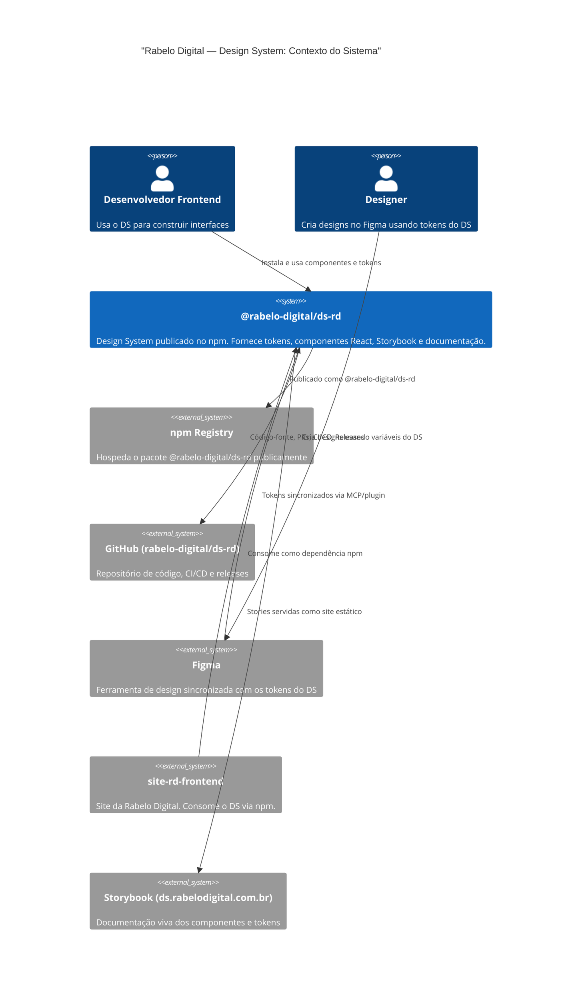

# C4 — Nível 1: Contexto do Sistema

## Descrição

O **Design System Rabelo Digital** (`@rabelo-digital/ds-rd`) é um sistema centralizado que serve como fonte da verdade para tokens visuais (cores, espaçamento, tipografia) e componentes React reutilizáveis.

### Atores externos

| Ator                   | Papel                                                              |
| ---------------------- | ------------------------------------------------------------------ |
| Desenvolvedor Frontend | Consome componentes e tokens para construir páginas e features     |
| Designer               | Usa variáveis Figma sincronizadas com os tokens para criar layouts |

### Sistemas externos

| Sistema          | Relação                                     |
| ---------------- | ------------------------------------------- |
| npm Registry     | Hospedagem pública do pacote                |
| GitHub           | Código-fonte, CI/CD e automação de releases |
| Figma            | Design sincronizado com tokens via MCP      |
| site-rd-frontend | Primeiro consumidor do DS                   |
| Storybook        | Documentação interativa dos componentes     |
